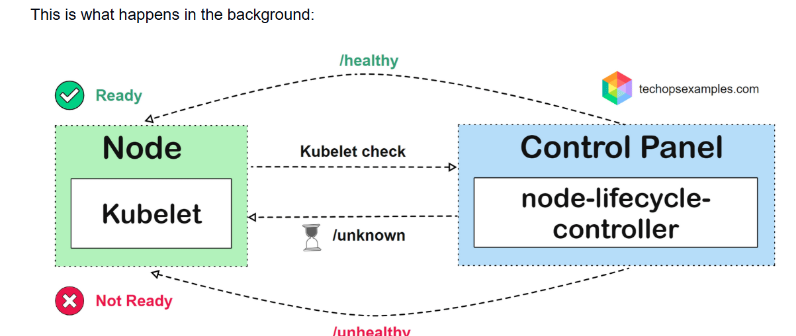
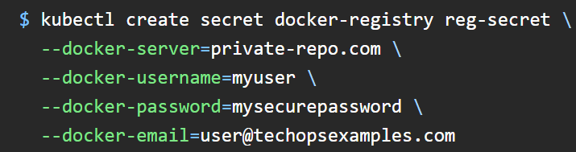
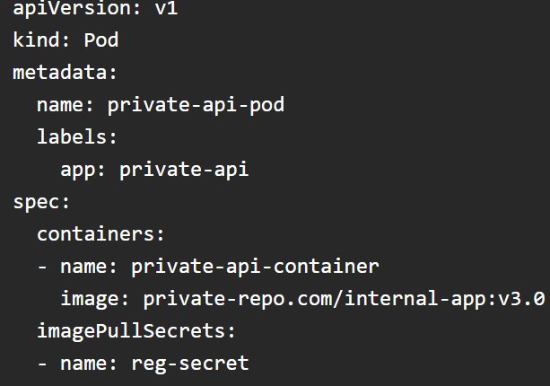

# 2-June26
was issue in terraform state file, i have made following changes 

 # day6
 change from key = "dev/terraform.tfstate" to dev/vpc/terraform.tfstate   
  backend "s3" {
    bucket       = "kalpesheic042026"
    key          = "dev/vpc/terraform.tfstate"
    region       = "ap-south-1"
    encrypt      = true
    use_lockfile = true
  }
  
made same changes in day10 and re-run plan from day10 root directory and it is working as expected.

# Use case
we have arround 50 microservices which are inter-depended to each others, all microservices are deployed in EKS cluster but for the payment, it has different cluster, 
it has few of monolothtic applications which are connected with Micro services as well payment application.
it has 3 main envoirments, Dev, QA and Prod, it has multiple aws accounts for the dev, qa and Prod and for the secret, it has different account, now customer is planning for the high availability DR solution which should support more then 10K concurrent users.

Cell should span multiple Zones, not to be a limited single AZ.
Each cell spans multiple AZs
Cell-A= Az1+Az2+Az3
Cell-B= Az2+Az2+Az3
Result- loss of Az1-> Cell Continues
loss of a node group-> Cell Continues
Loss of service in CellA->CellB unaffected

# How Large Companies Handle This
They don't usually force all traffic to stay in one AZ because that hurts availability.

Pattern 1: Multi-AZ Cell, Local Preference
Cell-A= AZ1+Az2+Az3 
Pattern 2: Topology-Aware Routing
Traffic prefers endponits in same zone
Client in AZ-1
    ↓
Service Endpoint in AZ-1

Pattern 3: Cell-Level Isolation
insted of 50 services-> 1 giant cluster
Create Cell-A and Cell-B( Most traffic styas inside cell)

# Most recommanded solution
Region
|
+-- Cell-A
|     AZ1 AZ2 AZ3
|
+-- Cell-B
|     AZ1 AZ2 AZ3
|
+-- Payment Cell
      AZ1 AZ2 AZ3
And enable:
Topology-aware routing
Multi-AZ node groups
Aurora Multi-AZ
Local caching (Redis)

# DR planning 
Phase-1 -Discovery and dependecny mapping 
Application name-> Criticality->RTO and RPO
 Payment->Critical->15 mins-> 1 min
 Order-> Medium-> 30 mins-> 30 mins
 Phase-2- Dependecny mapping
 Order Service
      |
Payment Service
      |
Payment Gateway

Phase-3 Define DR Strategy 
Pilot light-: 
Primary: Full
DR: Minimal

Warm Standby (Recommended)
Primary: 100%
DR: 20-30%

Phase-4: Build DR region infra
Primary- Ap-south-1
DR - Ap-southeast-1

Deploy infra through Terraform

Phase-5-Deploy empty EKS DR cluster

Phase-6- Integrate Harness
Harness
    |
----------------------
|                    |
Primary EKS      DR EKS

Create DR env in harness

# K8s Node not ready

Nodes might be marked as NotReady due to verious issues
Behind the Scences- Kubelet on each node is responsble for the reporting the node's status to the control plane, specifically the node-lifecycle-controller, the control plane then assesses data ( node absense or not) to determine the node's state.

Information is then relayed to the node-lifecycle-controller, which uses it to assign the node one of the following statuses.

true- All checks passed, node is healthy
false- one or more checks have failed, showing the node has issues and isn't functioning correctly.
unknown- the kubelet hasn't communicated with control plane within the expected timeframe.

Diagnosis-:
1. node status check
2. Node details and condition check
A. Memory Pressure
B. Disk Pressure
C. PID Pressure
3. Run → ping <node-IP> to check connectivity between the nodes. 
4. Run → systemctl status kubelet on the node to verify if the kubelet service is running properly
5. If the kube-proxy pod is in a crash loop or not running, it could cause network issues leading to the NotReady status.
How To Fix-:
Increase Resources:- Scale up the node or optimize pod resource requests and limits.
Monitor & Clean: Use top or htop to monitor usage, stop non-Kubernetes processes, and check for hardware issues.
Check Status: Run systemctl status kubelet.
A. active (exited): Restart with sudo systemctl restart kubelet.
B. inactive (dead): Check logs with sudo cat /var/log/kubelet.log to diagnose.
Resolve Kube-proxy Issues
Check Logs: Use kubectl logs <kube-proxy-pod-name> -n kube-system to review logs.
ensure the kube-proxy daemonSet is configured correctly, if needed, delete the kube-proxy pod to force a restart.

# What exactly happens during an imagepullbackoff
K8s requests the node to pull the image
Node sends request to docker daemon to pull image
Docker Daemon requests the image from the regisry
if the image found, the registry sends the image back to docker daemon
docker daemon pull the image to the node
if the image is successfully pulled, K8s marks the image ready.
If the image is not found, Docker Daemon reports the failure, Kubernetes retries pulling the image.
the retry fails, Kubernetes enters ImagePullBackOff state, preventing further retries.

# Image registry Authrization
Create a secret with credential to access the private registry

Link the secret to the POD's manifest to allow access.

