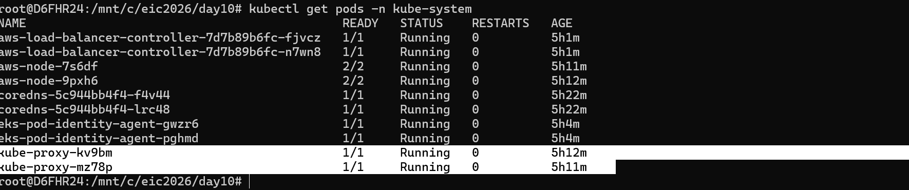

The Kubernetes project recommends using Gateway instead of Ingress. The Ingress API has been frozen

# bootstrap_Cluster_Creator_Admin_Permission 
Recommanded way- "bootstrap_cluster_creator_admin_permissions = true"
then immediately-: 
1. Create admin access entry for the SRE role
2. Validate access
3. Optionally remove depedency

# Notes
Ingress is kind of defination, ingress alone cannot function, it always needs a controller like
A. Nginx Controller
B. Aws load balancer Controller
C. Traefik
D. HAProxy 

Whenever we create Nginx ingress controller, it will use K8s ingressclass which will use NodePort IP/ ClusterIP to route request to Port.

Flow is NodeIP goes to Service IP and it goes to target port.

Service type- ingress- will create ALB
Service type- load balancer- will create NLB

Ingress- path based routring, hostbase routing and header base routing.

AWS load balancer controller- will be deployed in kube-system namespace.

Whenver we create a ingress resource this aws load balancer controller automatically provsion the application load balancer in aws, whenever we create a service type of load balancer it provision the NLB.

first we will deploy aws load balancer controller inside kube-system namespace, which continouslly watches for ingress and service objects in the cluster, for the example, if we want ingress resource for the retail application, will go ahead and deploy the ingress yaml manifest, Aws load balancer continosully watching that ingress mainfest and deploy ingress controller accrodingly.

we can define in annotation while create ingress, through annotation we can specify that whether particular ingress will be created in public or private network, which vpc will be used etc.

Ingress will always go with default which is instance mode, in the instance mode, Alb sends traffic to the NodePort(Worker node) to our K8s service, mean first requests send to the node, and node forwards traffic to the POD.

Instance mode Flow
End users--> LB-->target group(instance mode) --> NodePort --> POD
Instance mode, all worker nodes will be added in target group.

IP mode- The ALB directly targets to the POD IP address, there is no node port hope involved, we will get good performance and will be use VPC CNI plugin.

IP mode Flow
End users--> LB-->target group(iP mode)--> POD
IP mode, POD IP will be added in target group.

running aws-node are daemonset which is responsible for the CNI plugin.

1 download policy from(https://raw.githubusercontent.com/kubernetes-sigs/aws-load-balancer-controller/main/docs/install/iam_policy.json)
this json file(AWSLoadBalancerControllerIAMPolicy) has all required permission.

2. Create IAM role and attach the AWSLoadBalancerControllerIAMPolicy to that role and trust policy.
(This policy allows the load balancer controller to manage aws resources such ELB, target group and security groups)

3.  Create Trust Policy-Trust policy allows the EKS POD identity agent(PIA) to assume this role on behalf of the load balancer controller pod.
 
4. EKS Pod Identity Association between the IAM Role and ServiceAccount-this sercurly link Service account to the IAM role via EKS POD identity.

######################################
Ingress is a Kubernetes API object used to expose HTTP/HTTPS applications externally using:

host-based routing
path-based routing
TLS termination

Ingress Controller-Ingress resource only contains routing rules but Ingress Controller is the actual component that watches ingress manifests, creates load balancer configurations and routes traffic

alb.ingress.kubernetes.io/target-type: ip ==== ALB directly forwards traffic to POD IPs
it is avoid use of NodePort, better performance and direct pod routing.

Target Type- IP- Directly targetting to the POD IP, No nodeport hope involved, in that case will get good performance.
Will use AWS VPC CNI Plugin for this, it is available as a add-on.

aws-node pods are running as a daemonset which is related to AWS VPC-CNI 
user-> ALB-> target group(IP mode)-> POD 

inside pod, 
routes directly to pod 
required VPC CNI
better for EKS 

Target type- Instance mode-
ALB send traffic to Node port and node port forward requests to the correct pod- traffic send to worker node and from there requests send to the POD.
User-> ALB->targer group(mode instane)-> NodePort->POD 

Route to worker node
use NodePort
older approch

Traffic flow in ALB ingress
User-> route52-> ALB-> Ingress rules-> Service-> Pod

What is ingressClassName- It tells K8S which ingress controller should handle this ingress resource.
Because a cluster can have multiple ingress controllers, NGINX Ingress Controller or Amazon Web Services AWS Load Balancer Controller

type: NodePort
  ports:
    - port: 80
      targetPort: http
      protocol: TCP 
      name: http

As per the above block, where clusterIP comes into picture
when traffic reaches NodeIP:31555, kubeprxy applies iptables/IPVS rules
315555->cluster IP
Then ClusterIP service load balances traffic to pods.

NodePort itself does NOT directly know pods.
ClusterIP service knows:
endpoints
pod IPs
load balancing
That is why traffic must pass through ClusterIP layer
