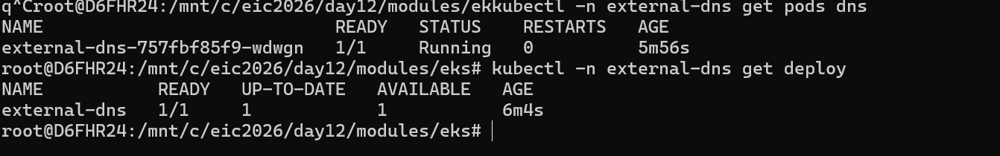
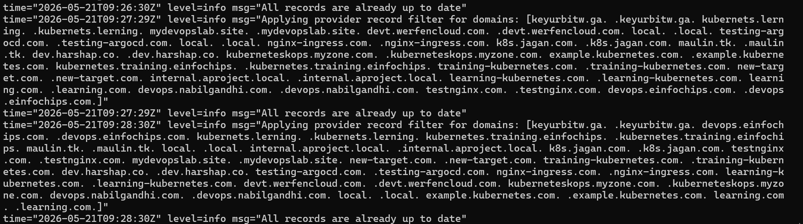
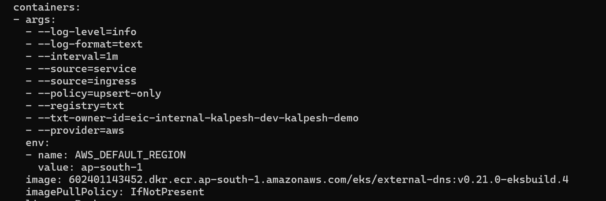

# External DNS

External DNS is a external DNS controller which is synced with cluster.
External DNS run as a pod inside a K8s cluster, it continously watches K8S API server for any changes either K8S ingress and K8S service, if this detect any Ingress/service with DNS annotation for this external DNS will create DNS record in Route-53
External DNS will use PIA for the securly autentication, for this we will have to create IAM role with policy, that policy should have access of external DNS SA to perform activity on route-53.
External DNS will be run via addons of external EKS Addons.
Same process will be applicable for the deletion also.

# Verify ExternalDNS Install

Note- Added code for the external dns in Day12 TF code.

 - --policy=upsert-only - this would update only changes, if we delete any ingress/services at K8s side, it will not delete any entry at route-53 side, if we changed hostname, it will go any update accrodingly 

 - --policy=sync-only= In that case if any delete any ingress/services at K8S side, it will delete any entry at route-53 side.

