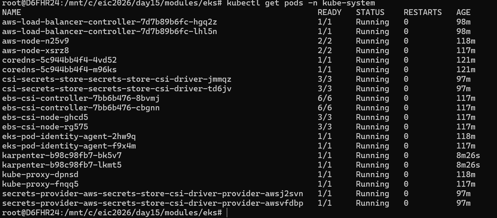
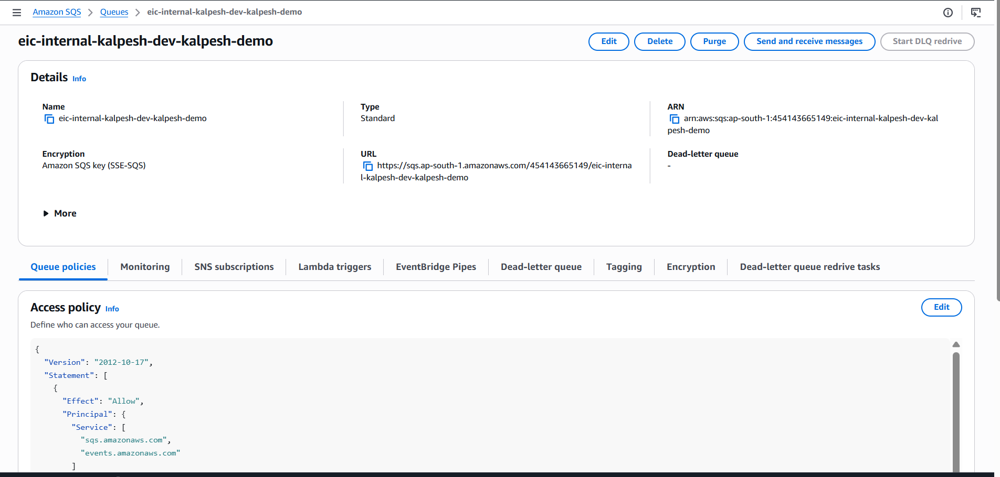
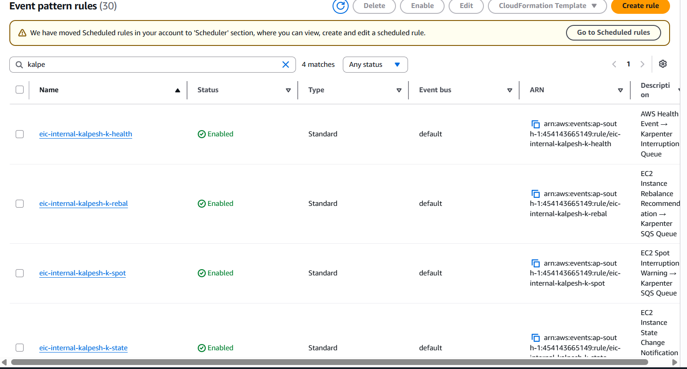
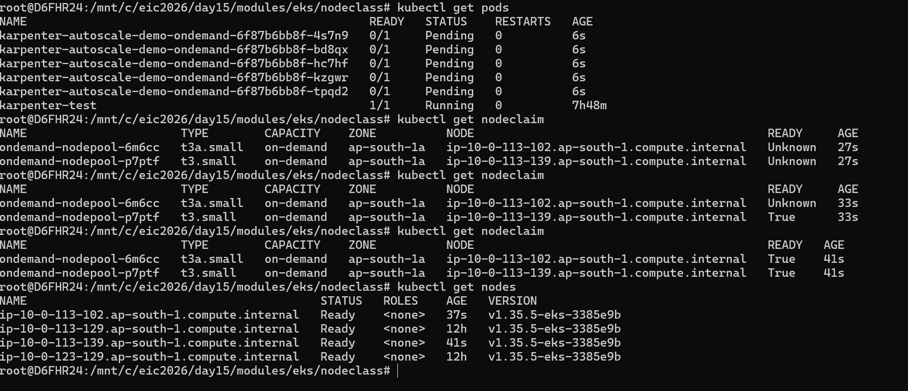
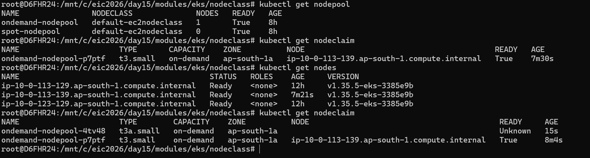

Bin Packaging- Efficently placing PODs onto a minumum numbers of nodes possible to reduce cost and improve utilization.

Karpenter Decide on 
1. CPU requests
2. Memory requests
3. Taint/Toleration
4. Affinity rules
5. Topology constraint
6. instance size
7. SPOT/On demand pricing

# Karpenter is better then autoscaler
A. No predefined Node group- 
while using Karpenter no need to predefined instance type in node group, Karpenter will decide node types best of mentioned PODs's requests resource.

B. Faster provisioing- 
Autoscaler relay on ASG policy while scale-out or Scale-In Instance in node group, which take almost more then 5 to 7 mins but Karpenter directly call to EC2 API and based on request it would intiate request and scale-out/in instnace which is faster then Autoscaler.

C. Better Cost Optimization- 
Karpneter always pickup mix instnaces from the wide range of instance families amoung them like on-demand and spot instnaces, it would decide best on mentioned resources requests in POD, this is best cost optimization solution. 
Autoscaler does work based on predefined Node group, it wouldn't change intenally based on requirement.

D. Active Consolidation and de-provising- 
Autoscaler would take time to decommsion whenever it has ZERO pod running, Karpenter is actively doing consolidation and deprovisioing and moved to cheaper nodes based on load, even Karpenter is more intelligent to decide whether use on-demand or Spot.

NodePool- Nodepool decide which instnace type( t2 or t3 ) will be launch and also decide that whether will use on-demand or spot.

EC2Nodeclass- will help to get which AMI, AMISelectorTerms, subnets tags and security group will be used at the time of launch
Every nodepool refernces the nodeclass
OS would come from the node-pool and AMI will be decided on EC2Nodeclass.

Notes-: Nodepool say what kind of node(node size, constraint) will create and Nodeclass will say, how to create them( like blue print what AMI, SG, VPC will be used)

Karpenter controller- Karpenter controller finds a Node Pool that satisfies pod requirments
PODs are created with resources requests and nodeselectors.

** Node selectors is best recommanded way to select node, either pods will be scheduled on on-demand or spot instance.
Karpenter controller is brain, which is schedule node based on PODs resource requirements.

Karpenter will not create node identically, it will create nodes based on PODs requirements

###
1. Setup Karpenter controller IAM 
Setup Karpenter Assume Role(pods.eks.amazonaws.com)-this role being used by the PIA.
Karpenter IAM policy- what karpenter will perfrom, 
With assume role and policy, will create IAM role 
same role will be attached with PIA.
 A. EC2 create instnace
 B. EC2 terminate instance
 C. SQS recive message
2. Setup EC2 Node IAM- we need to prepare IAM role which worker node will use, karpenter pod will create EC2 node that EC2 node required permission.
EC2 node Assume role(ec2.amazonaws.com) this is tradational EC2 profile approch.
EC2 Node IAM Policy- What can do this policy in AWS, those permission will provide here, those node will join EKS cluster, pull EC2 docker 
image and configure EC2 networking 
Ec2 node EKS Access entry- this would be use for the autentication.

3. Setup event bridge and SQS queue for EC2 spot instances interruption handling- it has 4 defined rules
A. Event bridge rule1-health event- when any maintaince happend, instance will be created by karpenter that would be notify to event bridge to 
sqs, karpenter would pulling Amazon SQS, whenever get message, it will terminate or create ec2 instance and also schedule a PODs from the 
problematic node to new node.
A. Event bridge rule-1 health event
B. Event bridge rule-2 EC2 spot instance
C. Event bridge rule-3 ec2 spot interruption
D. Event bridge rule-4 EC2 state changes.

4. Deploy Karpenter controller- for this setup4, need setup1, setup2 then step3.

# karpenter EC2Nodeclass
subnetSelectorTerms:
    - tags:
        kubernetes.io/cluster/retail-dev-eksdemo1: owned
        kubernetes.io/role/internal-elb: "1"
 #### owned and internal-elb: "1" ####
 if we keep only owned, worker nodes will be launch in punlic or private but if we put tags internal-elb: "1" then worker nodes will be launch only private subnets.

  tags:
    karpenter.sh/discovery: eic-internal-kalpesh-dev-kalpesh-demo
    Above tags will be tags whichever workernodes are managed by karpenter

# Karpenter nodepool
 - key: topology.kubernetes.io/zone
          operator: In
          values: ["us-east-1a", "us-east-1b", "us-east-1c"]  
# Must match the AZs where your EKS cluster has subnets configured
# Karpenter can only launch nodes in AZs with configured VPC subnets

 # Cluster-wide max scaling limit
  limits:
    cpu: "50"
We can set CPU limit for the karpenter cluster.

# Recommended disruption settings
 disruption:
    consolidationPolicy: WhenEmptyOrUnderutilized
    consolidateAfter: 30s  # How long to wait before consolidating
Above consolidationPolicy- Whenemptyorunderutilized- this policy ensure that karpneter will remove worker nodes which is empty or under utilized and this would happend after 30 seconds.

# Nodepool spot instance
# Add budgets to control disruption rate
    budgets:
      - nodes: "100%"  # Allow all nodes to be disrupted if needed
        reasons:
          - "Drifted"
          - "Underutilized"
          - "Empty"    
Above configuration helps to disrupt 100% 
Drifted- when AMI will update, this time Node will be replaced.
Underutilized- When instances are not being used or under utilized.
Empty- When instance is completely stale.

# Test autoscaling in on-demand 

# reduce replica=2

# FEATURE_GATES
Normally Karpenter launches Spot, On-demand EC2, but some enterprises already purchased. reserved EC2 capacity, this feature helps Karpenter. prefer already reserved capacity
# What is topology spread constraint?
A Kubernetes scheduling feature that distributes pods evenly across topology domains like:
zones
nodes
regions

to improve high availability

# Why are Kubernetes controllers usually spread across zones?
To avoid single AZ failure impacting critical control-plane workloads such as:
ingress controllers
autoscalers
Karpenter
metrics-server
DNS controllers