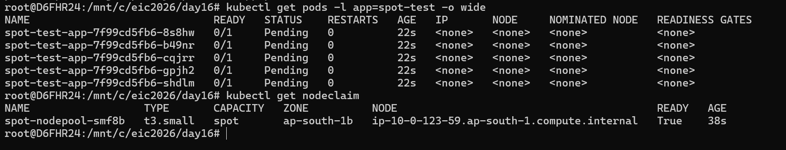
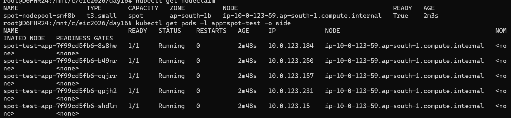

# Spot interruption with PDB 
Stge-1-Normal operation
POD disruption budget(PDB)- minavailable 3= if we have 5 pods are running in that case allow max unavailable 2 evication.

# Intruption detected in Spot instnace
When price may increse AWS API send intruption warring to event bridge, that event bridge will forward request to SQS queue.
Karpenter pulling sqs queues and recive message and go to the respetive node and cardon this particular node and marked as a unscheduled.
Karpenter works smartly and provising new spot node, karpenter works proactively, before cordn, it will provising node.

from aws warining to claim node has maximum 2 minutes to complete activity.
in stage 3, as per the above example, 2 pods will be rescheduled on new node, due to the PDB still 3 pods will still running on old node.
A Pod Disruption Budget (PDB) is very important in Kubernetes because it protects applications from becoming unavailable during voluntary disruptions.
in the stage4, remaining pods(3-5) will be shuting down in old node and start in new node.
if PDB is not defined properly, in that case all 5 PODs would have migrated from old to new nodes which lead application disruption.
now old node will be terminated.
Whole activity completed in max 2 mins, from AWS warning to terminated node.
AWS-->Event bridge--> SQS queue--> Karpenter--> terminated old node/provision new node

AWS sends interruption notice
        ↓
Karpenter detects interruption
        ↓
Node gets cordoned
        ↓
Pods start draining
        ↓
Scheduler moves pods elsewhere
        ↓
Node terminated

Above process completed in 2 mins interruption notice.

1. AWS sends interruption warning → EventBridge → SQS Queue
2. Karpenter polls SQS (every 10 seconds), detects message
3. Karpenter cordons node (stops new pod scheduling)
4. Karpenter provisions replacement node (proactive!)
5. Karpenter drains node (respects PodDisruptionBudgets)
6. Kubernetes reschedules pods to new node
7. Old node terminates after pods are safe

ip-10-0-123-59.ap-south-1.compute.internal

# HPA
1. Query metrics server(every 15 seconds)
2. calculate desire replicas
3. HPA, make scaling decision control loop every 15 seconds.

formula desired = current * (Actual/target)
desired = 3*(80/50) = 4.8=> 5

how HPA would scale, it is depend on behavor part, it is mentioned 300 seconds mean almost 5 mins, hpa would wait to take scale-down sometime this spike might be temoarraly, if it sustain for 5 mins then
it would take action.
rate limit policy, one is percentage base and seocnd is pod based.
Remove at-least 50% pods within 15 seconds.

sale-up policy has defind stabilizationwindowsecond=0, mean it will start increasing pods without waiting. 

# PDB, TSC and Nodeselector

PDB= it is ensure that a minimum number of pods remain availalble during voluntary

Topology Spread Constraints= help distrbut pods evenly acorss failure of domains.
Nodes
Zones
Regions

this help to improve high-availabilty, fault-tolerance and load-balncing 

kubernetes.io/hostname = Spread across nodes
topology.kubernetes.io/zone = Spread across AZs/zones
topology.kubernetes.io/region = Spread across regions 
maxSkew: 1 means imbalance cannot exceed 1 pod.

- maxSkew-1 = Pods should be distrubuted even, so that no need be overloaded.
suppose we have 3 nodes(a,b,c), now A->2, B->2, C->1, in that case diff would be 2-1=1
this is good configuration

if we have A=1, B=2 or C=0, in that case diff would be D=3-0=3 which is not good

topologykey= this would ensure that Pods should be scheduling acorss AZ.
whenunsatisfiable = ScheduleAnyway
Scheduleanyway- PODs will be schedule anyway without giving more priorty to maxskew.
whenUnsatisfiable: DoNotSchedule = K8s strickly enforces topology spread
if scheduling violate maxskew, pod will be reamin pending

Aws interruption notic->event bridge->sqs-> karpenter pull-> node cordn->replacement node provision-> pod drain-> reschedule on new nodes

