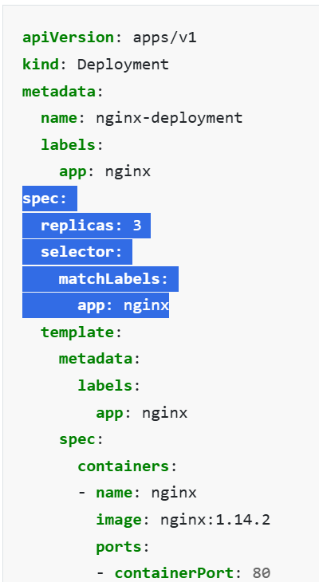
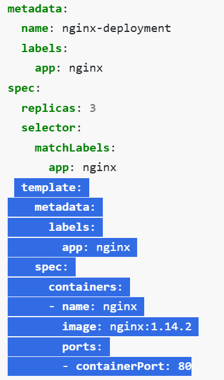
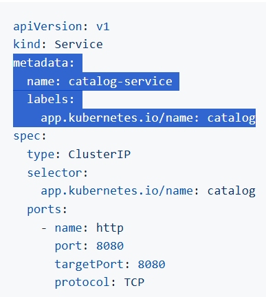
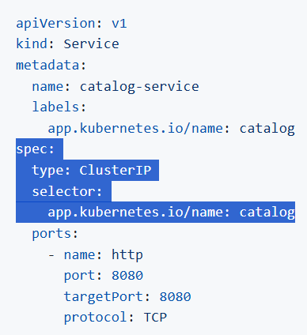

#### K8S Deployment################

Ensures the desired number of Pods are always running
Automatically replaces unhealthy Pods via its ReplicaSet
Supports rolling updates for version upgrades
Allows easy rollback to previous versions
Provides horizontal scaling with a single command

Flow: Deployment → manages → ReplicaSet → creates → Pods
Readiness Probe-If it fails, Pod is temporarily removed from Service endpoints
Liveness Probe-	If it fails repeatedly, kubelet restarts the container

RollingUpdate → replaces Pods gradually without downtime
maxUnavailable: 1 → ensures at most one Pod is down during rollout

Selector label-it tells that which POD is belongs to particular deployment

Below spec belongs to POD spec, whatever information is mentioned from template to below which is all related to POD.

Security context ensure that any volume mounted inside the pod are accessible by user id 1000 only, which is our non-root application user which is our app user.

runAsNonRoot: true-	Runs container as non-root user
readOnlyRootFilesystem: true-Prevents writes to filesystem
capabilities.drop: [ALL]-	Removes unnecessary Linux capabilities

Verify Deployment, ReplicaSet
kubectl get deployment
kubectl get replicaset
kubectl get pods -o wide

Scaling the Deployment
kubectl scale deployment catalog --replicas=3

Update the Deployment image
Deployment Revisions
kubectl rollout history deployment/catalog

# Update the Deployment
kubectl set image deployment/catalog catalog=public.ecr.aws/aws-containers/retail-store-sample-catalog:1.3.0
Deployment Revisions
kubectl rollout history deployment/catalog

Verify rollout status
kubectl rollout status deployment/catalog

Rollback to previous version
kubectl rollout undo deployment/catalog
Deployment Revisions
kubectl rollout history deployment/catalog

##### K8S Service ##############

whenever pods got restarted or schedule on another node, it is always get new IP, for the connect those POD always use Load balancer which send traffic to the respective Pods.
Cluster IP is kind of load balancer which works internal communication within cluster.
cluster IP- Cluster IP uses for the internal communication between our microservices
After creating the service, verify how Kubernetes automatically links Pods to the Service using labels.
how Cluster IP will send request to particular pods, selector lable always matches with service manifest with pod mainfest.
this selector would always send traffic to only pods which has selector label matches.

Service has two lables one is metadata label which uses for the filter and dashboard 

Below selector label is responsible for the route traffic, this selector lable should match with deployment selector label.

kubectl get pods -o wide
kubectl get endpointslices -l kubernetes.io/service-name=catalog-service
# key notes #
Kubernetes uses the selector labels in the Service definition to automatically discover Pods that match those labels. It then creates an EndpointSlice object listing the Pod IPs and ports that belong to that Service.

Apart from there are other services in K8s.
Nodeport
loadbalancer 
external name service 
headless service

####Kubernetes ConfigMap############
Configamp is an API object used to store non-confidential data in key-value pairs.
pods can consume configmaps as envoirnment variables.
configmap allows you to decouple environment-specific configuration from container images, so that it can be use easily.

1. ConfigMaps help externalize configuration from the container image.
2. We defined all environment variables explicitly, even defaults.
3. Deployment consumed ConfigMap via envFrom.
4. Verified that environment variables were successfully injected into the container.
